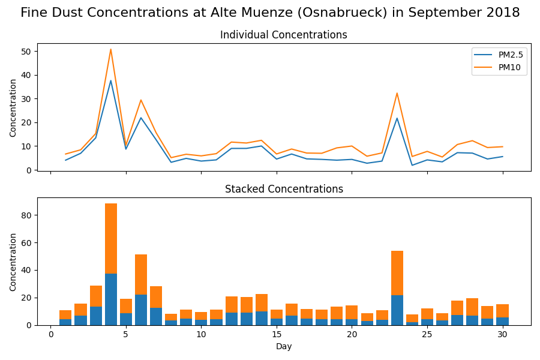
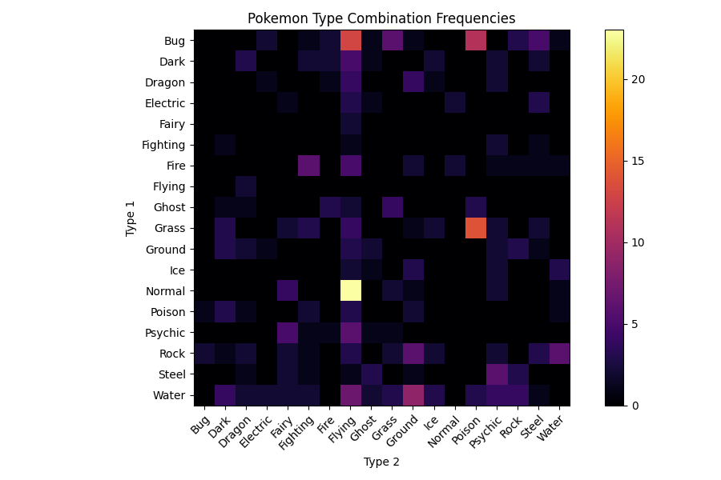

# Homework 07

## Deadline: Monday, 31st of May at 00:00 (2021-05-31 00:00:00 UTC+2)

This week's homework is all about visualizing data. The resulting plots will not only look pretty, but also demonstrate how figures for scientific publications can be created.  

Before you start, make sure your conda environment is activated and that you have all the packages listed in `requirements.txt` (e.g. with `pip install -r requirements.txt`). The most relevant package for this homework is `matplotlib`, but we will be using the full stack of previously introduced packages such as `numpy` and `pandas`.  

## A Word about Autograding for Visualizations

Autograding for visualizations is notoriously tricky, because **the produced image can have slight variations** depending on what operating system (Linux|Windows|MacOS) and what hardware (screen resolution, graphic card, etc.) the code is being run on. In the past, this homework was graded by comparing the pixels of the produced images to expected images, but even with a lenient tolerance setting this system led to a lot of frustration.  

This year, we are trying something different: We are still providing you with expected images, but **do not compare your output to these images**. Instead we use `pytest` to **check if your code has changed the appropriate attributes** in the `matplotlib` objects that your functions return. For you, that means no changes to the workflow of the previous homeworks.  

Hopefully, the changes will make this homework more enjoyable. Still, this homework is one of the best candidates for your **manual grading joker**, since it's possible that the autograding system will reject your plot, but a human can see with one look that you produced the right results. To use your manual grading joker, go to the course page on **StudIP**, then navigate to `Participant` &rarr; `Groups` and enroll in the group `Manual Grading Request for Homework 07`. This can only be done before the deadline.

## This Homework

There are 3 tasks in this homework:

* Plotting Air Quality Data: `airquality.py`
* Making a Custom Heatmap: `heatmap.py`
* Visalizing the Mandelbrot Set: `mandelbrot.py`

In all tasks, you are asked to write a function that returns a `Figure` object of shape `(9, 6)` as well as one or more `Axes` objects. You can use all packages that were introduced so far (`numpy`, `pandas`, `matplotlib`). As always, you have to pass 2 out of the 3 tasks in order to pass the homework.

**Useful resources:**

* Documentation of `plt`: [matplotlib.pyplot](https://matplotlib.org/stable/api/_as_gen/matplotlib.pyplot.html)
* Documentation of `Axes`: [matplotlib.axes](https://matplotlib.org/stable/api/axes_api.html)
* Documentation of `Figure`: [matplotlib.figure](https://matplotlib.org/stable/api/figure_api.html)

## Task 1 - Plotting Air Quality Data

In this task, you will plot air quality data that was measured at [Alte Münze](https://goo.gl/maps/vcuXE5LQ3zA5jstNA) in Osnabrück in September 2018. The data was retrieved from an [API](https://airapi.wurmloch.de/) provided by Hackspace Osnabrück, which sadly does not provide daily readings any more but still has some old data. The data was downloaded for your convenience to [data/alte_muenze_airquality.csv](data/alte_muenze_airquality.csv). You can learn more about the meaning of `PM2.5` and `PM10` on [Wikipedia](https://en.wikipedia.org/wiki/Particulates).

Your task is to write a function `plot_airquality` that creates a visualization of the fine dust particle pollution with two subplots, one line plot and one bar plot. The resulting plot should look like this: 

For this task, the data is already loaded and preprocessed for you in the function `load_air_data` from `helpers.py`. In future tasks, you will have to do that by yourself.  

Here are some steps that can be followed to solve this task:

1. Create the necessary `Figure` and `Axes` objects for the two subplots with a shared x-axis
2. Plot the columns `PM2.5` and `PM10` as lines in the upper subplot
3. Plot the columns `PM2.5` and `PM10` as stacked bars in the lower subplot
4. Set the necessary axis labels and titles
5. Set the overall `suptitle` and create a legend
6. Return the `Figure` object and the two `Axes` objects

## Task 2 - Making a Custom Heatmap

In this task, we will work with the `Pokemon` data set that we already know from `2021-homework06`. You can find it in [data/pokemon_no_duplicates.csv](data/pokemon_no_duplicates.csv).  

Your task is to write a function `make_heatmap` that creates a heatmap of the frequencies of `Type 1` and `Type 2` combinations of pokemons. More high-level packages such as [seaborn](https://seaborn.pydata.org/) have specialised functions for that, but we will do it with pure `matplotlib`. The resulting plot should look like this:

Some of the code from `2021-homework06` task 2 can be reused to do the necessary preprocessing - if you didn't solve the task, have a look at the [example solution](https://github.com/scientificprogrammingUOS/2021-homework06-alex-example/blob/master/pokemon.py).

Here are some steps that can be followed to solve this task:

1. Load and preprocess the data to raw pairwise combination counts using `pandas` functions such as `groupby`, `count`, `unstack` 
2. Create the necessary `Figure` and `Axes` objects
3. Plot the quadratic data with pairwise combination counts using `imshow` with the colormap `inferno`
4. Set the necessary labels and title for the `Axes` object
5. Create a colorbar on the right side of the plot
6. Return the `Figure` object and one `Axes` object

## Task 3 - Visualizing the Mandelbrot Set

In this task, we will visualize the famous [Mandelbrot Set](https://en.wikipedia.org/wiki/Mandelbrot_set). For this, you are given a function `mandelbrot` that returns a boolean array representing a rectangular view of the Mandelbrot Set. The resulting plot should look like this:

The `mandelbrot` function accepts positional and keyword arguments. You can leave the keyword arguments at their default value and use `x`, `y`, `dx`, `dy` to specify which part of the Mandelbrot Set will be visualized. `x` and `y` determine the upper left corner, `dx` and `dy` the offset from that point along the respective axis. We are interested in the main corpus, which lies between the locations `(-1.5, 1.0`) and  `(0.5, -1.0)`.

Here are some steps that can be followed to solve this task:

1. Create the necessary `Figure` and `Axes` objects
2. Create the Mandelbrot boolean array using `mandelbrot`
3. Plot the Mandelbrot data with the colormap `turbo`
4. Create an `annotation` that points out the beautiful [Seahorse Valley](http://www.alunw.freeuk.com/seahorsevalley.html) at `(147, 170)`
5. Turn off the unneeded axis of the plot
6. Return the `Figure` object and one `Axes` object

**Bonus:** Play around with the keyword parameters of `mandelbrot`. At which setting is the Seahorse Valley the most beautiful?
