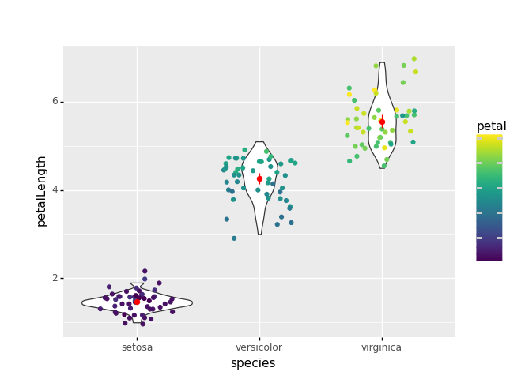
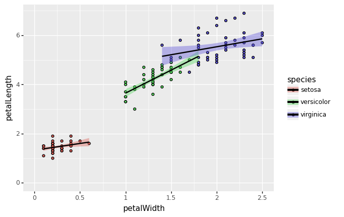
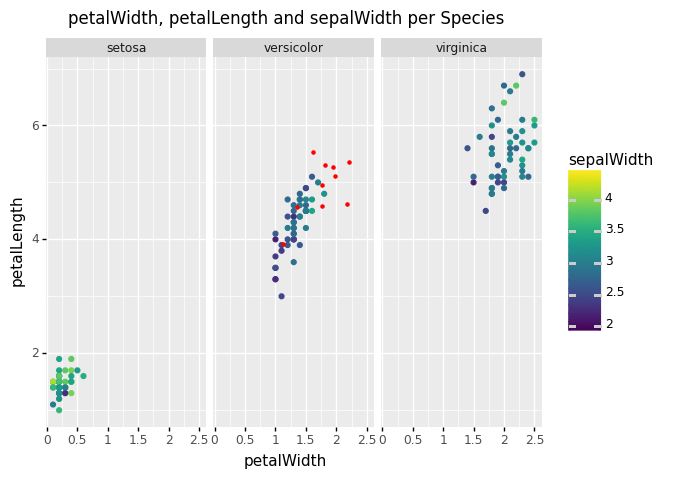
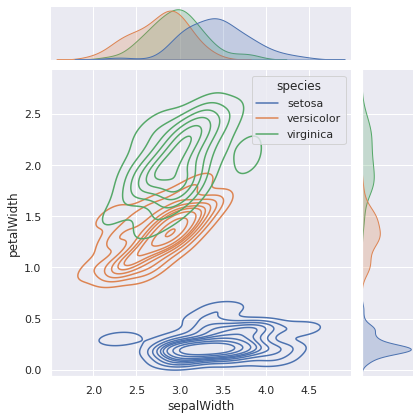

# Homework 09

## Deadline: Monday, 14th of June at 00:00 (2021-06-14 00:00:00 UTC+2)

This week's homework is all about visualizing data again. 
Before you start, make sure your conda environment is activated and that you have all the 
packages listed in `requirements.txt` (e.g. with `pip install -r requirements.txt`). 
The packages two main packages you will use are `nineplot` (aka `ggplot`) and `seaborn`. 
Further you will use `matplotlib` to customize the plots and `pandas `to handle the dataset. Don't worry if you get some `DeprecationWarning`s when running `pytest` - these are huge projects that sometimes contain soon-to-be-outdated code.
## A Word about Autograding for Visualizations

Autograding for visualizations is notoriously tricky, because **the produced image can have 
slight variations** depending on what operating system (Linux|Windows|MacOS) and what hardware 
(screen resolution, graphic card, etc.) the code is being run on. In the past, this homework 
was graded by comparing the pixels of the produced images to expected images, but even with a 
lenient tolerance setting this system led to a lot of frustration.  

This year, we are trying something different: We are still providing you with expected images, 
but **do not compare your output to these images**. Instead we use `pytest` to **check if your 
code has changed the appropriate attributes** in the `matplotlib` objects that your functions return. For you, that means no changes to the workflow of the previous homeworks.  

Hopefully, the changes will make this homework more enjoyable. Still, this homework is one of the 
best candidates for your **manual grading joker**, since it's possible that the autograding system 
will reject your plot, but a human can see with one look that you produced the right results.
To use your manual grading joker, go to the course page on **StudIP**, then navigate to 
`Participant` &rarr; `Groups` and enroll in the group `Manual Grading Request for Homework 09`. 
This can only be done before the deadline.

## This Homework

There are 3 tasks in this homework:
- Task 1 - Violin and Regression-Plot: `violin_regression.py`
- Task 2 - Scatterplot: `scatterplot.py`
- Task 3 - Density: `density.py`

The plots that you are supposed to make can be created by using the standard
functionality of the libraries. Don't try to do crazy customization. Generally, 
in this course, if you think you have to guess fanciful values for random 
keyword-arguments or the like, you're likely barking up the wrong tree - if your plots do not look the way they should you probably used the wrong function.

**What to return:** 

If you use ggplot the `.draw()` function created a matplotlib figure. If you only need
ggplot, return the drawn figure directly, i.e. `return (ggplot(..)).draw()`. If you are asked to customize
the plot using matplotlib, draw the ggplot and store the figure in a variable, which you can 
then customize. Then return the customized figure.

For seaborn just return the object that is returned by the plot function you are using.

**The data:**

The data the plots should be applied to is the famous iris dataset. It
is a standard machine learning problem to separate the three flower species
based on the sizes of their leafs.

|     |   petalLength |   petalWidth |   sepalLength |   sepalWidth | species    |
|----:|--------------:|-------------:|--------------:|-------------:|:-----------|
|   0 |           1.4 |          0.2 |           5.1 |          3.5 | setosa     |
|   1 |           1.4 |          0.2 |           4.9 |          3   | setosa     |
|   2 |           1.3 |          0.2 |           4.7 |          3.2 | setosa     |
|   3 |           1.5 |          0.2 |           4.6 |          3.1 | setosa     |
|   4 |           1.4 |          0.2 |           5   |          3.6 | setosa     |
|   5 |           1.7 |          0.4 |           5.4 |          3.9 | setosa     |
|   6 |           1.4 |          0.3 |           4.6 |          3.4 | setosa     |

## **Task 1 - Violin and Regression-Plot**
For this task you will use **ggplot** to create two plots. 

a) **Violinplot**: Write a function 
`make_violinplot(iris)` that creates a figure
with a violinplot of the `petalLength` for each species. Jitter the original data points on top
of the violins. Jitter with width and height variation of 0.3. The color of the points should encode the `petalWidth`.
Then add a summary of the data, that shows the mean and the
standard deviation in red.

b) **Regressionplot**: 
Write a function `make_regressionplot(iris)`. The resulting plot should contain the scattered 
points and a linear regression line with confidence bands for each species.
Make sure to set your xlim and ylim such that your plot ranges from 0 to the maximum of the 
respective value (petalWidth or petalLength). Hint: There isn't only an aesthetics for color,
but also for fill!

 
## **Task 2 - Scatterplot**
In this task we will use **ggplot** make a plot that combines four features of the dataset.
Write a function `make_scatterplot(iris, my_iris)`. Scatter `petalWidth` against `petalLength`. 
Include `sepalWidth` by using color. Make one facet of each species. Don't immediately return this figure,
but instead `.draw()` it, such that you can alter it with matplotlib.
Then use matplotlib to add a `suptitle` to the figure: `'petalWidth, petalLength and sepalWidth per Species'`, 
fontsize 12. Afterwards, use matplotlib to `scatter` 
(see [docs](https://matplotlib.org/3.1.1/api/_as_gen/matplotlib.pyplot.scatter.html))
the contents of the small dataset `my_iris`, 
(which contains custom measurements for a few iris of type `versicolor`) ontop of the 
`axes`-object responsible for that iris-type. The `color` for this matplotlib-scatterplot is 
supposed to be `red` and its size (`s`) is supposed to be `5`. Return the figure-object.

 

## **Task 3 - Density** 
In this task you will use `seaborn`.
Write a function `make_densityplot(iris)`
that displays the joint density of `sepalWidth` and `petalWidth` for each species, plus the marginal
density of the two variables on the side of the plot. The marginals densities should be shaded.
There is a `seaborn` **figure level** function that does this for you with very little configuration.
It is important that you use the figure level function. Otherwise the autograding will fail.
Consult the function's documentation to find out how to achieve the exact 
customizations. 

> Good luck!
