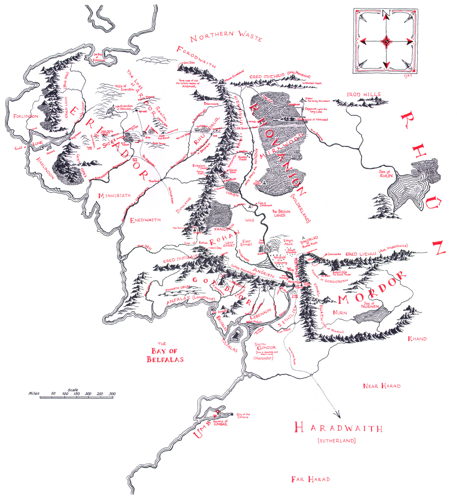
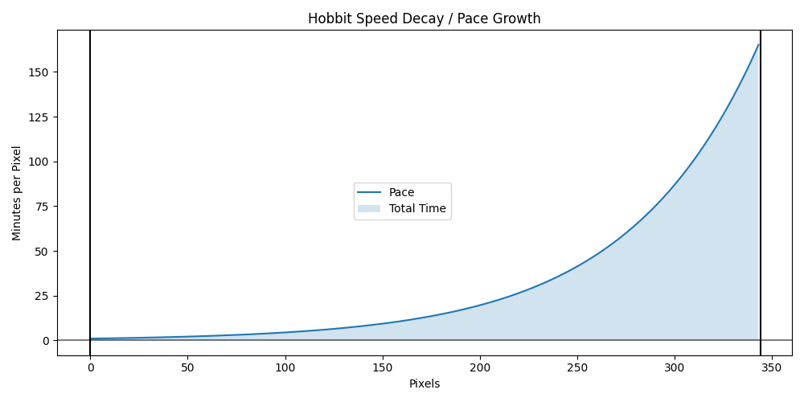
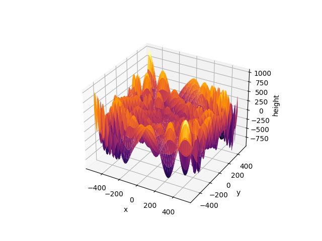

# Homework 10

## Deadline: Monday, 21st of June at 00:00 (2021-06-21 00:00:00 UTC+2)

This week's homework is all about mathematical programming with `scipy`.

Before you start, make sure your conda environment is activated and that you have installed all the packages listed in `requirements.txt` (e.g. with `pip install -r requirements.txt`). 

There are 3 tasks in this homework:

* `dijkstra.py`: Use [*Dijkstra's* algorithm](https://en.wikipedia.org/wiki/Dijkstra%27s_algorithm) to find the shortest path for a hypothetical hobbit wandering across Middle Earth
* `runtime.py`: Use integration to find out how long it would take a hypothetical hobbit to walk one path
* `pit.py`: Use optimization to find the lowest pit of the *Mountains of Mordor* where Gollum lurks


## Task 1: Dijkstra

In this task, you will find the best path for a hypothetical hobbit who is wandering across middle earth. For your convenience, the approximate pixel coordinates of relevant locations were extracted from the following map:

<div align="center"><a href="map.png"></a></div>

The map was downloaded [here](http://www.anarda.net/tolkien/dibujos/mapas/gmiddleearth2.jpg). You can find the coordinates as `(x, y)` tuples in the variable `COORDS`. The variable `INDEX` contains the accompanying location names.

Write a function `find_shortest_path(start, target)` in `dijkstra.py` which accepts location names `start` and `target` and returns a list of location names that denotes the shortest path from `start` to `target`. For example, running `find_shortest_path("The Shire", "Mount Doom")` should return `['The Shire', 'Isengard', 'Minas Morgul', 'Mount Doom']`. 

First, use either `scipy.spatial.distance.pdist` and `scipy.spatial.distance.squareform` or simply `scipy.spatial.distance_matrix` to create a pairwise square distance matrix that contains the Euclidean distance from each location to each other location as the eagle flies (directly). 

However, hobbits do not always have an eagle handy, so you will have to calculate in some road blocks. Set the following path distances in the distance matrix to `np.inf`, since they are impossible to go directly:

* There is no direct path from `The Shire` to `Minas Tirith` or `Minas Morgul` (one must go through the `Misty Mountains`)
* There is no direct path from `Rivendell` to `Minas Tirith` or `Minas Morgul` (one must go through the `Misty Mountains`)
* The only direct path to `Mount Doom` is from `Minas Morgul`

You do not have to worry about the way back - you can just modify the upper triangular section of the matrix.  

Now use [`scipy.sparse.csgraph.dijkstra`](https://docs.scipy.org/doc/scipy/reference/generated/scipy.sparse.csgraph.dijkstra.html) to compute all shortest path traversals for the square distance matrix. The function may seem a bit confusing at first, but really all we need is the `predecessors` matrix, which contains the following information: For each row index denoting a start node and each column index denoting a target node, the best predecessor to the target node is given.  

Consider for example the following `predecessors` matrix:

```
[[-9999     0     0     0     0     3     3     6]
 [    1 -9999     1     1     1     2     2     6]
 [    2     2 -9999     2     2     2     2     6]
 [    3     3     3 -9999     3     3     3     6]
 [    4     4     4     4 -9999     4     4     6]
 [    5     5     5     5     5 -9999     5     6]
 [    6     6     6     6     6     6 -9999     6]
 [    7     7     7     7     7     7     7 -9999]]

```

The shortest path from node `0` to all other nodes is given in the first row: From node `0` to nodes `1`, `2`, `3`, `4`, the best way is to go directly; before going to `5`, `6` from `0`, one should go to `3`; before going to `7` from `0`, one should go to `6`. The path from each node to itself is `-9999` to avoid cycles. Consequently, the best path to go from `0` to `7` is `[0, 3, 6, 7]`.

Armed with this information, you should be able to write the function `find_shortest_path`.

**Sidenote:** Using Euclidean distance in a flat map is of course not going the yield the exact distance on a presumably globe-like body. For an example of how *exact* distances can be calculated on Middle Earth, see [this blog post about projecting the map of Middle Earth on Google Earth](https://rhodesmill.org/brandon/2009/google-earth-and-middle-earth/).


## Task 2: Runtime

In this task, you will approximate how long it would take a hypothetical hobbit to walk from one location on Middle Earth to another. Like dwarves, hobbits are natural sprinters. As such, their speed decays exponentially, so you will have to take that into account. Concretely, traversing each pixel will take the hobbit `1.5` percent longer than the previous pixel.

As a first step, you will have to compute the Euclidean distance between the two given coordinates. The function `calculate_runtime(start_coords, target_coords)` accepts two arguments, both of which are `(x, y)` coordinate vectors. After determining the Euclidean distance between the two points, you have to define a decay function for the hobbit's speed.  

This can be done using a `lambda` function. Decreasing the speed (pixels per minute) is the same as increasing the inverse speed or *pace* (minutes per pixel). The number of minutes per pixel should start out at `1.000` and then increase by `1.5` percent for each pixel, so `pace(0) = 1.000`, `pace(1) = 1.015`, `pace(2) = 1.030` and so on.

Integrate the function over the interval of `[0, distance]` to find out how many minutes it will take the hobbit to go that distance without break. Convert the number of minutes to hours and return it. Here is a visualization that might make this process easier to understand:



In the example above, the hobbit takes 11190 minutes, so about 186 hours, to walk from `The Shire` to `Rivendell`. This is roughly consistent with contemporary estimates, which can be found [here](https://imgur.com/gallery/aXw6q).


## Task 3: Pit

In this task, you will find the global minimum of the height function of the *Mountains of Mordor*. Gollum is rumored to be lurking in the lowest pit, and it is imperative that he be found, since he has valuable information. The landscape looks as follows:



Use all your skills and the `scipy.optimize` module to find the global minimum of this function! For you convenience, it is imported from `helpers.py`. Return the location as a tuple of (`x`, `y`) coordinates. The exact coordinates of the minimum are of course unknown, but there are rumours that it is somewhere within the `BOUNDS` defined in `pit.py`.  

**Hint:** Due to the tricky nature of the *Mountains of Mordor*, conventional local methods of minimization may fail to find the global minimum. Scavenge the [`scipy.optimize`](https://docs.scipy.org/doc/scipy/reference/optimize.html) documentation for more effective minimization functions!

> Good luck!
