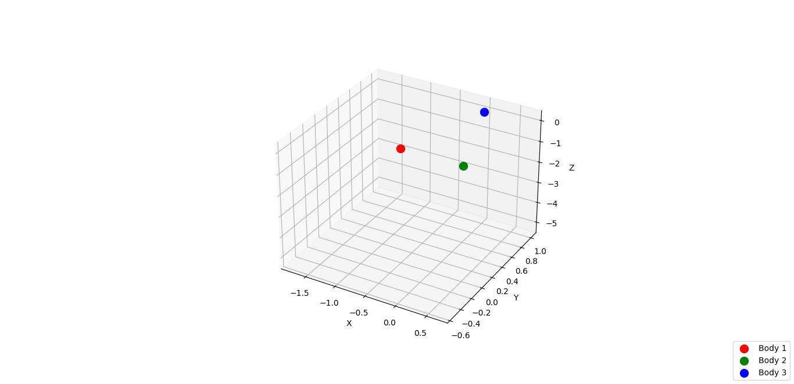

# 2021-homework10-bonus

## Deadline: Wednesday, 30th of June at 12:00 (2021-06-30 12:00:00 UTC+2)

This is a bonus assignment. That means you can hand in a solution for it in order to get one extra "pass" that counts towards your passing the course, but there is no disadvantage in not handing in a solution.  

The task in this assignment is to create an animated 3D visualization of the [three-body problem](https://en.wikipedia.org/wiki/Three-body_problem). For this, we will use `numpy` for mathematical operations, `scipy` to simulate the ODE system that governs the motions of three bodies in space, and `matplotlib` to create the animated visualization.  

There is no `pytest` or autograding for this homework, just some asserts that you can use to check that you are on the right track. To pass this homework, send a mail to [mpoemsl@uos.de](mailto:mpoemsl@uos.de) with an animated gif file that you have produced. The gif should look something like this:



The gif file that you hand in should **not** be identical to the one shown above, so change some of the initial conditions parameters before you produce your final gif. Of yourse, you still have to push your code to this repo in addition to sending the gif. Since there is no `pytest` and no autograding, there will also not be a checkmark - don't worry about that for this assignment.

## Overview

You will work in three files, following the steps we need to make our gif:

1. `simulation.py`: Simulation of the three-body problem using `scipy.integrate.solve_ivp`
2. `visualization.py`: Creation of a static plot showing the results of the simulation
3. `animation.py`: Animation of the plot using `matplotlib.animation.FuncAnimation`

Additionally, there is the file `main.py`, which is the one that calls the functions from `simulation.py`, `visualization.py`, and `animation.py`. It ties everything together. To test your code, run `python main.py`.


## Simulation

In this step, we will simulate the [three-body problem](https://en.wikipedia.org/wiki/Three-body_problem), a scenario where there are three bodies in  close proximity in space with certain masses, velocities and positions. Their pairwise gravitation forces interact in such a way that the dynamical system exhibits beautiful but chaotic behaviour. There is no closed-form analytic solution, so the best we can do to simulate the behaviour is use numerical methods.  

The behaviour of the three bodies can be described with a system of [Ordinary Differential Equations](https://en.wikipedia.org/wiki/Ordinary_differential_equation), which describe the change in position and velocity of the bodies rather than their absolute values. A good primer video on both differential equations and the three-body problem can be found [here](https://www.3blue1brown.com/videos-blog/2019/4/23/differential-equations). The part about the three-body problem starts at about `17:21`.  

As you can see, this is a topic that is heavy on both mathematics and physics. However, this is a programming course! Feel free to dig in deeper into the rabbit hole of three-body problem and ODEs if it suits your interests, but in this assignment, we will treat the three-body problem simulation strictly as a programming exercise. So here's what you need to know as a programmer to simulate the three-body problem:

In the file `simulation.py`, there is a function `three_body_equations(t, state, m1, m2, m3)` that contains a simplified ODE system for the three body problem. You can ignore the time `t`, which is needed to make the function signature valid for the `scipy` ODE solver. `state` is a one-dimensional `np.ndarray` that contains the state of the system at time `t`. The state contains 18 variables which describe the bodies. For each of the three bodies, there are three coordinates and three velocities (one for each dimension in space). The order is like this:

```
state = (
    x1, y1, z1,
    x2, y2, z2,
    x3, y3, z3,
    vx1, vy1, vz1,
    vx2, vy2, vz2,
    vx3, vy3, vz3
)
```
First the three coordinates of body 1 for each dimension `x1`, `y1`, `z1`. Together, these make up the position of body 1, `r1`. The same goes for body 2 and body 3. Then, the velocities of body 1 for each dimension `vx1, vy1, vz1`, which make up the velocity of body 1, `v1`. The same goes for body 2 and body 3.  

In addition to `t` and `state`, `three_body_equations` takes as input the masses of the three bodies, `m1`, `m2`, `m3`. They are not contained in the state, since they remain fixed during the movement of the bodies. Within `three_body_equations`, there are the Newtonian equations of motion as given on [Wikipedia](https://en.wikipedia.org/wiki/Three-body_problem#Mathematical_description). Constants like `G` were summarized in `K1` and `K2` for simplicity and to avoid having to deal with units.

Your task is to write a function `simulate_three_body_problem(init_state, masses, n_time_steps)` that receives a pre-defined initial state, masses, and number of time steps as arguments and returns the 9 position values for each time step in a tuple `(x1, y1, z1, x2, y2, z2, x3, y3, z3)`. Each element in this tuple is supposed to be a `np.ndarray` with shape `(n_time_steps,)`. 

To do that, use the ODE solver [`scipy.integrate.solve_ivp`](https://docs.scipy.org/doc/scipy/reference/generated/scipy.integrate.solve_ivp.html). The function should be integrated over the interval `(0, n_time_steps / 50)`, with evaluation of the solution every `0.02`. You will have to find a way to pass the masses to `three_body_equations` as additional arguments. We are interested in the `"y"` field of the return value. As a last step, extract the positions and bring them into the required form to return.

## Visualization

The visualization will be done as a 3D projection with `matplotlib` in the function `plot_three_body_problem(positions)` in the file `visualization.py`. First, create one `Figure` and one `Axes` object with `figsize=(15, 15)` and `projection="3d"`. Then, plot the orbits (paths) of the planets using `ax.plot`. Use `x1`, `y1`, `z1` for body 1 and the other position coordinates respectively for body 1 and body 2.  

Use `ax.scatter` with `marker="o"` and `s=100` to plot the bodies at their last positions only. Finally, add axis labels and a legend and return the `Figure` and `Axes` object. If you have done everything correctly, running `python main.py` will now show a static visualization of the three-body problem.

## Animation

We will use [`matplotlib.animation.FuncAnimation`](https://matplotlib.org/stable/api/_as_gen/matplotlib.animation.FuncAnimation.html) to animate the previously static plot in the function `animate_three_body_problem(fig, ax, positions)` in `animation.py`. This kind of animation works by repeatedly calling a function to alter the data of the already created plot frame by frame. For that, we will need the `Lines` objects that were created by `ax.plot` (the `orbits`), which are stored in `ax.lines`, as well as the `Collection` objects that were created by `ax.scatter` (the `bodies`), which are stored in `ax.collections`. 

You are given a function `update_plot(time_step, bodies, orbits, positions)`, which updates the underlying data of the plotted bodies and orbits for one given time step. Use `matplotlib.animation.FuncAnimation` to create an animation from this function. You will have to find a way to pass `bodies`, `orbits` and `positions` as additional arguments to `update_plot`. `20` is a good value for `interval`.

Return the `matplotlib.animation.FuncAnimation` object and run `python main.py`. If you did everything right, this should create a file `result/3bdy.gif`. Change the initial state and masses in `main.py` a bit to get a different animation than the one in `expected/3bdy.gif`. When you are satisified, send the resulting gif to [mpoemsl@uos.de](mailto:mpoemsl@uos.de) and push your code to GitHub. Congratulations - you have passed this homework!


## Acknowledgements

The idea for the animated visualization as well as many code snippets used in this task were taken from [this blog post](https://towardsdatascience.com/modelling-the-three-body-problem-in-classical-mechanics-using-python-9dc270ad7767). In addition, [a GitHub search of Python code for "three body problem"](https://github.com/search?l=Python&q=three+body+problem&type=Repositories) yields about 50 results, many of which served as inspiration for this task.
