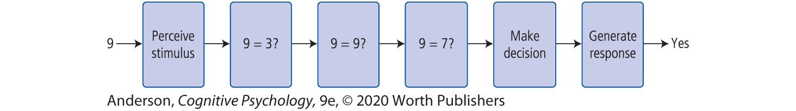

# Homework 12

## Deadline: Monday, 5th of July at 00:00 (2021-07-05 00:00:00 UTC+2)

## The Sternberg Task

The Sternberg item-recognition task is a widely used paradigm to study the short-term memory of humans. It tries to answer the question of how we search for items we memorized in our working memory.

When we memorize items and try to recall them, this recall could either be serial or in parallel:
* If it was parallel, we could recall all stored items simultaneously.
* If it was serial, items are recalled one after the other. Note that 'serial' does not imply any order of the items yet, it could be encoding-based (forward or backward) or in an arbitrary order.  
Serial recall can be sub-divided into self-terminating recall and exhaustive recall:
  * Self-terminating recall means that as soon as the entry we try to recall is found, we end our search.
  * Exhaustive means that we always go through all items in our working memory, even if we found the one we're looking for already.

The Steinberg task tries to check which of these three possibilities hold by testing the following experimental setup:
* 1-6 numbers between 1 and 9 are presented one after another in a random order
* Afterwards, a single number is presented,
* There are 2 seconds waiting time
* The subject has to tell if the single number was part of the sequence from before.

The hypotheses are the following:
* If the recall-process was parallel, there would (for longer sequences) be either no increase or a jumpy increase in response time 
* If the recall-process was serial and self-terminating, the response time would on average increase with every item, as in these cases where the target is not part of the sequence one searches through all elements, and otherwise the search is terminated after, on average, half of the items. This would lead to an averaged curve with decreasing slope (non-linear increase)
* If the recall-process was serial and exhaustive, the response time would increase linearly with every item.

Below an example of the decision process for the probe **9** is depicted.  
**Spoiler:** It turns out the recall-process is serial and exhaustive.

### Our Experiment

In this homework, we try to re-create Steinberg's original task using *Expyriment*. The precise experimental setup looks like the following:

* The `experiment` consists of 132 `trials`, where the first 12 are practice-trials, followed by two `blocks` of 60 trials each.
* After each the practice-trials and the first main block, there is a pause where the subject can relax.
* One trial consists of 1-6 consecutively presented digits (1200ms per digit), then 1800 ms of white screen, 100ms fix-cross, again 100ms white screen, then the target digit, where the user has maximally 5000ms time to respond with either Yes [Y] or No [N].
* In between trials there is a pause of 1000ms.
* Every combination of the length of the sequence (1-6) and expected answer (yes/no) appears 5 times per main block (6x2x5x2 = 120 trials), plus 12 practice-trials which are a random choice out of the 120 possible ones.

As it is almost impossible to properly test graphical interfaces, the code for the actual presentation of the stimuli (including proper timing, data logging, instructions, and formatting) is already prepared for you. The only thing left to implement is the actual experiment design.

A video of the finished experiment is available at https://youtu.be/ZYzSM8ZzR38 - It may help to understand how to structure the experiment.

### Your task

This week there is only one task which you have to pass. There is no good way to separate experiment design into
multiple subtasks. The workload of this task should be similar to passing 2/3 subtasks from other homeworks.

In the file `sternberg_task.py`, you'll find the function `make_design`, which you are supposed to fill with code. In this function, you are supposed to add three blocks to its argument `exp`, where the first one is named `"Practice"`, the second `"First Block"`, and the third `"Second Block"`.   
The two main blocks consist of 60 trials each, containing every combination of the length of the sequence (1-6) and expected answer (yes/no) 5 times. So we have 6 x 2 x 5 = 60 trials. You should, however, create 5 individual trials, and not one trial of each kind with 5 copies (otherwise we would get the same number sequence 5 times).  
Every Trial has two `factors`: The length of the respective sequence, `length`, as well as a boolean value `does_appear` indicating if the target was part of the sequence or not (the expected answer).
Depending on the `length`-factor, every trial is supposed to have 2-7 stimuli: The 1-6 distinct numbers between
1 and 9 (each of type `expyriment.stimuli.TextLine`), plus the target number itself (also of type `TextLine`, but with red `text_colour`sternberg task). If `does_appear` is `True` in the trial, the number should be randomly selected from
the numbers shown before, otherwise it should not be part of the before shown sequence.
The practice-block contains a random sample of 12 of these trials. All blocks are supposed to be shuffled.

The test-file will test all of these constraints pretty strictly. To actually implement it, it is probably more helpful to regularly execute your code -- the function `conduct_experiment` will also indicate if something is wrong by either failing or behaving in unexpected ways.

If you're uncertain about how to implement this in practice, it always helps to have a look at some examples - the [Expyriment-Code-Stash](https://github.com/expyriment/expyriment-stash) is a good address for that. Further, it always helps to [read the docs!](https://docs.expyriment.org/expyriment.html) If you didn't understand my explanation of the task, look at the original paper: `Sternberg, S. (1966). High speed scanning in human memory. Science 153: 652-654`

> Good luck!
